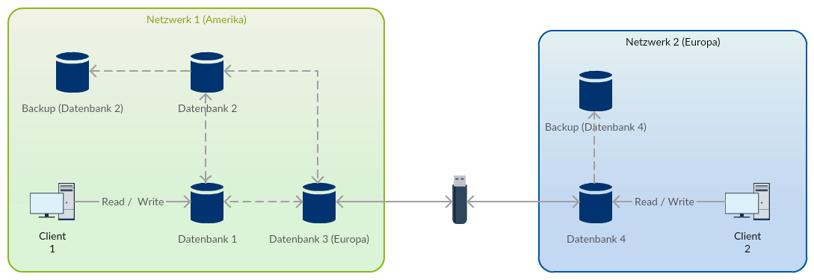

# Fallbeispiel: Asynchrone bidirektionale Replikation

In diesem Kapitel wird eine Replikationsstrategie betrachtet, die für ein System entwickelt wurde. Es werden die verschiedenen Vorraussetzungen und Anforderungen genannt und die Strategie hergeleitet.

Das Datenbanksystem besteht aus vielen verteilten Knoten, an allen soll geschrieben werden. Die Distanz zwischen den Knoten ist teilweise sehr groß, sie befinden si ch auf verschiedenen Kontinenten. Synchrone Replikation ist hiermit schwierig zu erreichen, trotzdem soll eine möglichst hohe Aktualität an allen verfügbaren Knoten gegeben sein. Abbildung 5 zeigt vereinfacht den gewünschten Aufbau des Systems.

**

*Abbildung 5: Systemaufbau*

Wie auf der Abbildung zu sehen ist, sind nicht alle Knoten an dasselbe Netz angeschlossen, was den durchgängigen Einsatz eines einzelnen Verfahren erschwert. Insbesondere das **Primary Copy** wird hierdurch ausgeschlossen. Schreibsperren müssen anders als bei den meisten Verfahren üblich verwaltet werden, da kein zentrales System vorhanden ist.

Als Datenbankmanagementsystem wird SAP Adaptive Server Enterprise (ASE, ehemals Sybase) genutzt. Es bietet sich der Einsatz eines Replikationsservers an, der ebenfalls von Sybase angeboten wird, da hier die Kompatibilität in jedem Fall gegeben ist.

Die Replikationsserver arbeiten mit dem **Warm Standby** Verfahren, bei dem Transaktionslogs ausgelesen werden und an die Replikate gesendet werden. Jedes Replikat hat einen zugehörigen Replikationsserver, da dieser die Daten zwar an mehrere Replikate schicken, nicht aber von mehreren Datenbanken replizieren kann. Zum Initialisieren der Datenbanken wird eine **Materialisierung** angeboten, durch die ein aktueller Datenbestand auf das Replikat gespielt wird.

Für die Datenbankserver außerhalb des Netzes wird die Methode **Cold Standby** genutzt. Hierzu werden die Tabellen aus den Datenbanken als .bcp-Datei exportiert, per Speichermedium in das andere Netz übertragen und dort eingespielt. Beide Verfahren werden bidirektional betrieben. Die folgende Abbildung zeigt den Systemaufbau mit Replikation.

*Abbildung 6: Systemaufbau mit Replikation*

Damit es keine Synchronisationskonflikte gibt, werden die Schreibsperren inhaltlich in der Datenbank verwaltet. Jeder Datenbankserver erhält eine eigene, eindeutige *Site-ID*, aus dieser die primären Schlüssel der erstellten Daten generiert werden. Dadurch lässt sich sicherstellen, dass kein Primärschlüssel doppelt vergeben wird. Um zu verhindern, dass Daten bearbeitet werden, die eventuell nicht auf aktuellem Stand sind, wird ein sogenannter *Responsible Producer* eingeführt und in den erstellten Datensätzen vermerkt. Nur der *Responsible Producer* kann einen Datensatz direkt ändern, andere können Änderungsvorschläge erstellen, die dem *Reponsible Producer* des originalen Datensatzes nach Synchronisation der Daten vorgelegt werden. Responsible Producer können somit Personen oder Personengruppen sein, die an demselben Standort auf die Datenbank zugreifen.

Zusätzlich werden noch Backupsysteme betrieben, die über Datenbankdumps täglich aktualisiert werden. Dadurch ist das System insgesamt sehr ausfallsicher, der Ausfall eines Knotens beeinflusst auch nicht die Möglichkeit, weiter an den anderen Replikation zu arbeiten. Fällt der Transferknoten (Datenbank 3) zwischen den beiden Netzen aus, kann es allerdings zu größeren Abweichungen in den Datenbeständen kommen.

[Bidirektionale Replikation](06_peer_to_peer.md) | [Fazit](08_conclusion.md) 
